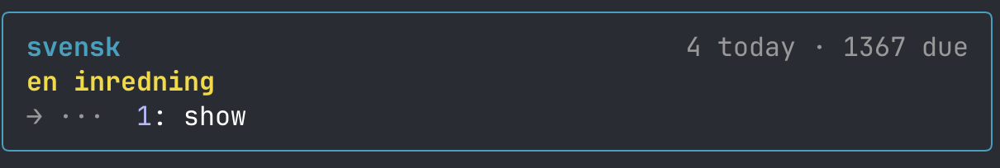
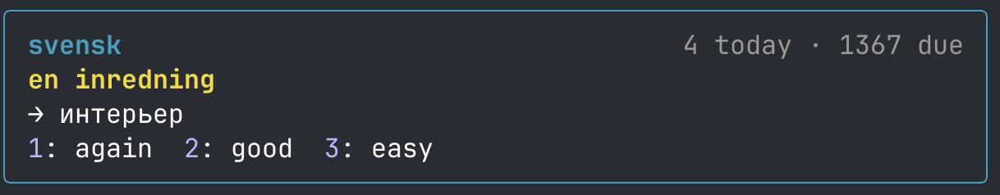

# medan

A Claude Code mod that shows a due Anki card above the prompt while Claude works.

*Medan* is Swedish for "while".





Press `1` to show the answer, then `2` for again or `3` for easy. The grade goes to Anki through
[AnkiConnect](https://ankiweb.net/shared/info/2055492159), so it counts as a normal review and
Anki schedules the card as usual. The band only appears while a turn is running. When Claude
finishes, it hides and leaves the prompt alone.

## Requirements

- Claude Code 2.1.287 or later (mods support)
- Anki desktop, running, with the AnkiConnect add-on (code `2055492159`)

If Anki is closed, the band shows a dim `Anki offline` line and nothing else.

## Install

```
/plugin marketplace add avlihachev/medan
/plugin install medan@medan
/reload-plugins
```

Or run it from a clone:

```
git clone https://github.com/avlihachev/medan
claude --plugin-dir ./medan
```

## Settings

Change them in `/config`, or in `~/.claude/settings.json`:

```json
"pluginConfigs": {
  "medan": { "options": { "deck": "Svensk" } }
}
```

| Option | Default | What it does |
| --- | --- | --- |
| `deck` | `Default` | Deck to review, subdecks included |
| `ankiConnectUrl` | `http://localhost:8765` | Where AnkiConnect listens |
| `showKey` | `1` | Shows the answer |
| `againKey` | `2` | Grades Again |
| `hardKey` | *(empty)* | Grades Hard |
| `goodKey` | *(empty)* | Grades Good |
| `easyKey` | `3` | Grades Easy |

A key is one digit or one lowercase letter. An empty key hides that button. For Anki's own layout,
set `againKey` `1`, `hardKey` `2`, `goodKey` `3` and `easyKey` `4`.

Any note type works. Cards are shown the way Anki renders them, as text: question on top,
the part after `<hr id=answer>` as the answer.

## Keys

Digits work straight from an empty composer. Letters only reach the band once it has focus: click
it or press `ctrl+x tab`. If `showKey` is also a grade's key, a grade pressed within 0.4 s of
`show` is ignored, so a double tap doesn't grade a card you haven't read.

## Development

```
claude plugin validate .
claude plugin test .
```

## License

MIT
